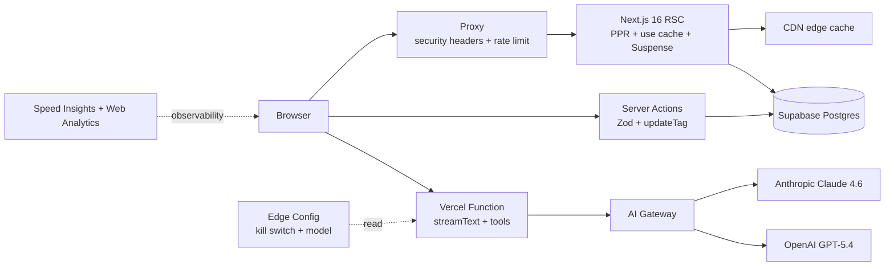

# DocHub — Source Control for Documents

A GitHub-style review-and-merge workflow for long-lived shared documents (PRDs, runbooks, policies, security questionnaires), with an AI coworker that proposes structured edits via tool calls.

Built on **Next.js 16 + AI SDK 6 + Supabase**, deployed on **Vercel Fluid Compute**.

---

## The problem

Cross-functional teams edit the same documents in Notion / Google Docs / Confluence and end up with:

- No review trail — last write wins, no diff history.
- No atomic merges — concurrent edits clobber each other.
- No diff-aware comments — feedback gets stranded in side threads.
- No place for an AI to **propose** edits without overwriting the source.

DocHub treats the document as a `main` branch. Every edit — human or AI — opens a Change Request with a unified/split diff, threaded comments, and a one-click merge that updates the source of truth.

---

## How it works

1. **Pin** a markdown doc as source of truth (drag-and-drop upload).
2. Click **AI Branch**. Pick a model (Claude or GPT), ask for a change in plain English — "tighten the goals section, add a security paragraph, fix grammar." The AI streams back targeted edits as **tool calls** (`proposeReplacement`, `proposeInsertion`), each with a rationale.
3. Review the live-computed diff, name the branch, **Create branch**.
4. Open the resulting Change Request, comment, **Approve**, **Merge**. The source doc updates in the same request and a new commit appears in History.

---

## Architecture



### Rendering & caching

| Concept | Where it lives in the code |
|---|---|
| `cacheComponents: true` (PPR) | [`next.config.ts`](next.config.ts) |
| Static shell (header / nav / footer) | [`app/(app)/layout.tsx`](app/(app)/layout.tsx) — Server Component, instant from CDN |
| Cached server fetchers | [`app/_data/documents.ts`](app/_data/documents.ts), [`app/_data/change-requests.ts`](app/_data/change-requests.ts), [`app/_data/commits.ts`](app/_data/commits.ts) — `'use cache'` + `cacheLife('hours')` + `cacheTag(...)` |
| Dynamic streamed boundaries | Suspense around the open-PR list and commit history; the PR list is intentionally NOT cached |
| Same-request freshness on merge | Server Actions call `updateTag('document')`, `updateTag('commits:...')`, `updateTag('change-request:...')` so the merged doc refreshes in the same request |
| Parallel routes for the changes pane | [`app/(app)/changes/@list/`](app/(app)/changes/@list) — the sidebar list stays mounted across PR navigation |
| URL-driven filter | [`components/change-request-filter.tsx`](components/change-request-filter.tsx) writes `?filter=…&q=…`; only the `@list` Suspense boundary re-streams |
| Per-PR SEO metadata | `generateMetadata` in [`app/(app)/changes/[crId]/page.tsx`](<app/(app)/changes/[crId]/page.tsx>) sets a per-PR title and description |

### Mutations

All writes go through Server Actions in [`app/_actions/`](app/_actions/). Each one:

1. Validates with **Zod**.
2. Writes to Supabase via the cookie-bound server client.
3. Calls `updateTag()` for cache scopes that should refresh in the same request, and `revalidatePath()` for adjacent routes.

`useOptimistic` + `useTransition` give the comment thread and merge buttons sub-100 ms responsiveness without giving up the server-as-source-of-truth model. The comment input is backed by [`hooks/use-draft-storage.ts`](hooks/use-draft-storage.ts) so a refresh or disconnect doesn't lose typing.

### AI Branch

| Piece | File |
|---|---|
| Streamed route | [`app/api/ai-edit/route.ts`](app/api/ai-edit/route.ts) |
| AI SDK 6 `streamText` with two tools | same — `proposeReplacement`, `proposeInsertion` |
| AI Gateway routing | plain `'anthropic/claude-sonnet-4.6'` or `'openai/gpt-5.4'` model strings |
| Model picker (reusable) | [`components/model-picker.tsx`](components/model-picker.tsx) + [`lib/models.ts`](lib/models.ts) |
| Kill switch + admin override | [`lib/flags.ts`](lib/flags.ts) (Edge Config), read at the top of the route |
| Client UI with live tool-call cards | [`components/ai-branch-modal.tsx`](components/ai-branch-modal.tsx) — `useChat({ transport: new DefaultChatTransport({ api, body }) })` |
| Apply proposals + diff preview | client-side `applyProposals()` reuses the existing `DiffViewer` |
| Audit trail | `ai_metadata` JSONB column captures the model + instructions + every tool call |

### Security & observability

- **Proxy** ([`proxy.ts`](proxy.ts), Next.js 16's renamed Middleware convention): security headers (CSP, X-Frame-Options, Referrer-Policy, Permissions-Policy, X-Content-Type-Options) on every response.
- **Rate limit**: 10 req/min/IP on `POST /api/ai-edit` via Vercel Runtime Cache (`@vercel/functions` `getCache()` — no Redis required). Fails open if the cache layer hiccups.
- **Speed Insights + Web Analytics** wired in [`app/layout.tsx`](app/layout.tsx) (production-only).

### Vercel-platform configuration

- [`vercel.ts`](vercel.ts) — typed config with cache-control headers for static assets.
- OIDC tokens via `vercel env pull` — no `OPENAI_API_KEY` / `ANTHROPIC_API_KEY` anywhere.

---

## Notable design choices

- **One pinned document at a time** — enforced at the database layer via a partial unique index. Pinning a new doc unpins the existing one; previous merge history stays intact via foreign keys.
- **Two Supabase clients** — cookie-bound for mutations (slot for RLS), service-style for cached reads (`cookies()` is forbidden inside `use cache`).
- **Optimistic comments, NOT optimistic merges** — comments are commutative; merges change the entire doc and need server-side authority.
- **Human-in-the-loop AI** — there is no auto-merge path. The user always reviews the diff before a Change Request exists.
- **Edge Config kill switch** — `aiBranchEnabled` flips the AI feature off without a redeploy.
- **No API routes for writes** — Server Actions replace fetch + JSON + validation + revalidation in one function. Only `/api/ai-edit` remains as a route handler because of its streaming protocol.

---

## Local development

### 1. Provision Supabase

Create a project at [supabase.com](https://supabase.com) (or via the Vercel Marketplace) and run [`supabase/migrations/0001_init.sql`](supabase/migrations/0001_init.sql) in the SQL editor.

### 2. Link to Vercel

```bash
pnpm install
pnpm dlx vercel link
pnpm dlx vercel env pull .env.local
```

This pulls `VERCEL_OIDC_TOKEN` (for AI Gateway), `NEXT_PUBLIC_SUPABASE_URL`, `NEXT_PUBLIC_SUPABASE_ANON_KEY`, and (optionally) `EDGE_CONFIG`.

Enable **AI Gateway** in `Project → Settings → AI Gateway`.

### 3. (Optional) Edge Config feature flags

In the Vercel dashboard, create an Edge Config store and connect it. Add two keys:

```json
{
  "aiBranchEnabled": true,
  "aiModel": "auto"
}
```

Toggle `aiBranchEnabled: false` to disable AI Branch without redeploying.

### 4. Run

```bash
pnpm dev
```

Open [http://localhost:3000](http://localhost:3000). The first visit lands on `/upload` to pin a source document; after that the rest of the app is wired up.

---

## Project structure

```
app/
  layout.tsx                  Root layout (fonts, Speed Insights, Analytics)
  page.tsx                    Redirect to /document or /upload
  (app)/
    layout.tsx                Chrome (header, nav, footer, persona picker)
    document/page.tsx         Pinned doc view
    upload/page.tsx           Drag-drop markdown upload + pin
    history/page.tsx          Commit history
    changes/
      layout.tsx              Parallel-route container
      page.tsx                Empty state (main pane)
      @list/                  Sidebar slot — stays mounted across PR navigation
        page.tsx              List for /changes
        [crId]/page.tsx       List for /changes/[crId] (same list, selected)
        default.tsx           Fallback for unmatched sub-routes
      [crId]/page.tsx         PR detail + generateMetadata (SEO)
  api/
    ai-edit/route.ts          streamText + tools via AI Gateway
  _data/                      'use cache' server fetchers
  _actions/                   'use server' Server Actions with Zod + updateTag
components/                   UI (shadcn + custom)
hooks/
  use-draft-storage.ts        localStorage-backed draft persistence
lib/
  flags.ts                    Edge Config helpers
  models.ts                   Allowed AI Gateway models
  runtime-cache.ts            Rate limit on top of Vercel Runtime Cache
  cache-tags.ts               Cache tag naming conventions
  current-user.ts             Cookie-backed persona
  tour.ts                     First-visit tour cookie gate
  supabase/
    server.ts                 Cookie-bound client (mutations)
    service.ts                Non-cookie client (cached reads)
proxy.ts                      Security headers + AI route rate limit
vercel.ts                     Typed Vercel project config
supabase/migrations/          Postgres schema
```
