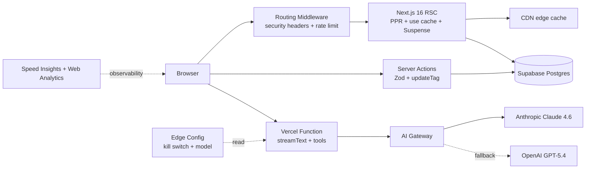

# DocHub — Source Control for Documents

A GitHub-style review-and-merge workflow for long-lived shared documents (PRDs, runbooks, policies, security questionnaires), with an AI coworker that proposes structured edits via tool calls.

 **Next.js 16 + AI SDK 6 + Supabase**, deployed on **Vercel Fluid Compute**.

---

## The problem

Cross-functional teams edit the same documents in Notion / Google Docs / Confluence and end up with:

- No review trail — last write wins, no diff history.
- No atomic merges — concurrent edits clobber each other.
- No diff-aware comments — feedback gets stranded in side threads.
- No place for an AI to **propose** edits without overwriting the source.

DocHub treats the document as a `main` branch. Every edit — human or AI — opens a Change Request with a unified/split diff, threaded comments, and a one-click merge that updates the source of truth.

---

## Demo flow

1. **Pin** a markdown doc as source of truth (drag-and-drop upload).
2. Click **AI Branch**. Ask Claude for a change — "tighten the goals section, add a security paragraph, fix grammar." Claude streams back targeted edits as **tool calls** (`proposeReplacement`, `proposeInsertion`), each with a rationale you can read as it arrives.
3. Review the live-computed diff, name the branch, **Create branch**.
4. Open the PR, comment, **Approve**, **Merge**. The source doc refreshes in the same request — no client roundtrip — and a new commit appears in History.
5. Track A "money slide": open DevTools Network → static shell paints from the CDN, CR list streams in via the RSC payload, optimistic comments land in &lt;50 ms.

---

## Architecture



### Rendering & caching

| Concept | Where it lives in the code |
|---|---|
| `cacheComponents: true` (PPR) | [`next.config.ts`](next.config.ts) |
| Static shell (header / nav / footer) | [`app/(app)/layout.tsx`](app/(app)/layout.tsx) — Server Component, instant from CDN |
| Cached server fetchers | [`app/_data/documents.ts`](app/_data/documents.ts), [`app/_data/change-requests.ts`](app/_data/change-requests.ts), [`app/_data/commits.ts`](app/_data/commits.ts) — `'use cache'` + `cacheLife('hours')` + `cacheTag(...)` |
| Dynamic streamed boundaries | Suspense around the open-PR list and commit history; the PR list is intentionally NOT cached (freshness wins) |
| Same-request freshness on merge | Server Actions call `updateTag('document')`, `updateTag('commits:...')`, `updateTag('change-request:...')` so the merged doc refreshes in the same request |
| Parallel routes for the changes pane | [`app/(app)/changes/@list/`](app/(app)/changes/@list) — the sidebar list stays mounted across PR navigation (no scroll loss, no remount) |
| URL-driven filter | [`components/change-request-filter.tsx`](components/change-request-filter.tsx) writes `?filter=…&q=…`; only the `@list` Suspense boundary re-streams |
| Per-PR SEO + OG | `generateMetadata` in [`app/(app)/changes/[crId]/page.tsx`](app/(app)/changes/[crId]/page.tsx) reuses the cached `getChangeRequest` — no extra DB hit |

### Mutations

All writes go through Server Actions in [`app/_actions/`](app/_actions/). Each one:

1. Validates with **Zod** (typed errors returned via `useActionState`).
2. Writes to Supabase via the cookie-bound server client (slot for RLS in v2).
3. Calls `updateTag()` for cache scopes that should refresh **this request**, and `revalidatePath()` for adjacent routes (e.g. the sidebar list).

`useOptimistic` + `useTransition` give the comment thread and merge buttons sub-100 ms responsiveness without sacrificing the server-as-source-of-truth model.

### AI Branch

| Piece | File |
|---|---|
| Streamed route, Node runtime, Fluid Compute | [`app/api/ai-edit/route.ts`](app/api/ai-edit/route.ts) |
| AI SDK 6 `streamText` with two tools | same — `proposeReplacement`, `proposeInsertion` |
| AI Gateway routing | plain `'anthropic/claude-sonnet-4.6'` model string |
| Kill switch + model override | [`lib/flags.ts`](lib/flags.ts) (Edge Config), read at the top of the route |
| Client UI with live tool-call cards | [`components/ai-branch-modal.tsx`](components/ai-branch-modal.tsx) — `useChat({ transport: new DefaultChatTransport({ api, body }) })` |
| Apply proposals + diff preview | client-side `applyProposals()` reuses the existing `DiffViewer` |
| Audit trail | `ai_metadata` JSONB column captures the model + instructions + every tool call for traceability |

### Security & observability

- **Routing Middleware** ([`middleware.ts`](middleware.ts)): security headers (CSP, X-Frame-Options, Referrer-Policy, Permissions-Policy, X-Content-Type-Options) on every response.
- **Rate limit**: 10 req/min/IP on `POST /api/ai-edit` via Vercel Runtime Cache (`@vercel/functions` `getCache()` — no Redis required). Fails open if the cache layer hiccups.
- **Speed Insights + Web Analytics** wired in [`app/layout.tsx`](app/layout.tsx) (production-only to keep dev clean).
- **Vercel Agent** can be enabled on the GitHub repo for automated PR review.

### Vercel-platform configuration

- [`vercel.ts`](vercel.ts) (replaces `vercel.json`) — typed config with cache-control headers for static assets.
- OIDC tokens via `vercel env pull` — no `OPENAI_API_KEY` / `ANTHROPIC_API_KEY` anywhere.

---

## Trade-offs (worth volunteering in the interview)

- **Why Node, not Edge, for `/api/ai-edit`?** Cache Components + several `use cache` features need Node. Fluid Compute is the default and already beats Edge for long-tail I/O like LLM streaming — Active CPU pricing means we don't pay during token waits.
- **Why `cacheComponents: true` globally?** The doc body almost never changes. Caching it with a tag I can `updateTag()` on merge gives me CDN-fast reads + perfect freshness, no client-side cache invalidation logic.
- **Why optimistic UI for comments but not for merges?** Comments are commutative (out-of-order arrival is fine). Merges change the entire document and need a server-side transaction; rolling them back optimistically is a footgun.
- **Why not Workflow SDK here?** AI Branch is single-step (request → tool calls → response). I'd reach for Workflow on multi-step durable flows like scheduled compliance audits or cross-doc refactors.
- **Why Supabase, not Neon?** Both work via the Marketplace. Supabase Realtime is a one-step v2 upgrade for live PR comments / presence; Auth is right there too.
- **What breaks at scale?** PR table grows fastest — partition by `document_id` past ~1 M rows. AI costs scale with usage — exactly what AI Gateway **tags** + per-feature budgets are for (set `aiBranchEnabled: false` in Edge Config as the panic button).
- **What about RLS?** Off in v1 for demo simplicity. v2 turns on RLS using Clerk JWTs surfaced through the Supabase server client; the persona picker becomes a real auth flow.

---

## Local development

### 1. Provision Supabase

Create a project at [supabase.com](https://supabase.com) (or via Vercel Marketplace) and run [`supabase/migrations/0001_init.sql`](supabase/migrations/0001_init.sql) in the SQL editor.

### 2. Link to Vercel

```bash
pnpm install
pnpm dlx vercel link
pnpm dlx vercel env pull .env.local
```

This pulls `VERCEL_OIDC_TOKEN` (for AI Gateway), `NEXT_PUBLIC_SUPABASE_URL`, `NEXT_PUBLIC_SUPABASE_ANON_KEY`, and (optionally) `EDGE_CONFIG`.

Enable **AI Gateway** in `Project → Settings → AI Gateway`.

### 3. (Optional) Edge Config feature flags

In the Vercel dashboard, create an Edge Config store and connect it. Add two keys:

```json
{
  "aiBranchEnabled": true,
  "aiModel": "auto"
}
```

Toggle `aiBranchEnabled: false` to instantly kill the AI Branch button without redeploying.

### 4. Run

```bash
pnpm dev
```

Open [http://localhost:3000](http://localhost:3000). The first visit lands on `/upload` to pin a source document; after that everything else is wired up.

---

## Project structure

```
app/
  layout.tsx                  Root layout (fonts, Speed Insights, Analytics)
  page.tsx                    Redirect to /document or /upload
  (app)/
    layout.tsx                Chrome (header, nav, footer, persona picker)
    document/page.tsx         Pinned doc view (cached, CDN-fast)
    upload/page.tsx           Drag-drop markdown upload + pin
    history/page.tsx          Commit history (cached + Suspense streamed)
    changes/
      layout.tsx              Parallel-route container
      page.tsx                Empty state (main pane)
      @list/                  Sidebar slot — stays mounted across PR navigation
        page.tsx              List for /changes
        [crId]/page.tsx       List for /changes/[crId] (same list, selected)
        default.tsx           Fallback for unmatched sub-routes
      [crId]/page.tsx         PR detail + generateMetadata (SEO)
  api/
    ai-edit/route.ts          streamText + tools via AI Gateway
  _data/                      'use cache' server fetchers
  _actions/                   'use server' Server Actions with Zod + updateTag
components/                   UI (shadcn + custom)
lib/
  flags.ts                    Edge Config helpers
  runtime-cache.ts            Rate limit on top of Vercel Runtime Cache
  cache-tags.ts               Cache tag naming conventions
  current-user.ts             Cookie-backed persona (Clerk stub)
  supabase/
    server.ts                 Cookie-bound client (mutations, future RLS)
    service.ts                Non-cookie client (cached reads — `use cache` constraint)
middleware.ts                 Security headers + AI route rate limit
vercel.ts                     Typed Vercel project config
supabase/migrations/          Postgres schema
PLAN.md                       Live build plan + decision log
```

---

## Built for the Vercel SA take-home

Walk through [PLAN.md](PLAN.md) for the full decision log — every phase, every trade-off, every blocker, in build order.
